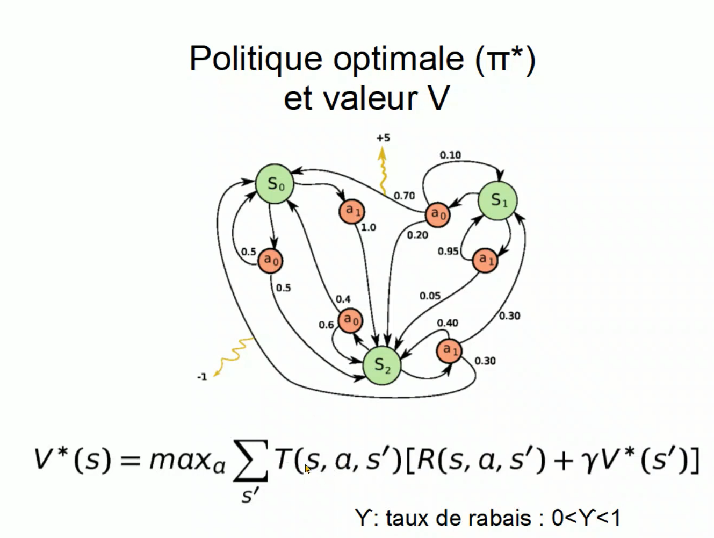

<h3>Apprentissage par renforcement </h3>

 Cet exemple montre un simple exemple d'implémentation d'un algorithme
 d'apprentissage par renforcement
 Ici on suppose que : 
 <ul>
 <li>nous avons un environement à 3 états S0, S1 et S2</li>
 <li>Dans chaque état on peut prendre deux actions a0 et a1</li>
  <li>Pour chaque action, on connait les probabilités que l'action provoque une transition vers un autre état</li>
 </ul>

<h4>Console Après exécution des 200 itérations</h4>
<pre>
 <code>
---------------------------------
Itération => 198
State 0, Action 0 => 8.213472058788597
State 0, Action 1 => 8.424073911426586 <==

State 1, Action 0 => 11.919142466792213 <==
State 1, Action 1 => 11.1782297718513

State 2, Action 0 => 8.255592433198053
State 2, Action 1 => 8.86744623236299 <==
---------------------------------
Itération => 199
State 0, Action 0 => 8.213472068300048
State 0, Action 1 => 8.42407392074484 <==

State 1, Action 0 => 11.919142475789549 <==
State 1, Action 1 => 11.17822978043731

State 2, Action 0 => 8.255592442329943
State 2, Action 1 => 8.867446241310237 <==
</code>
</pre>

 <h4>Politique optimale : </h4>
 D'après les résultats, l'agorithme conclut la politique optimale suivante :
 <ul>
  <li>Quand on est dans S0, on prend l'action a0 qui nous ramène vers S1</li> 
  <li>Quand on est dans S1, on prend l'action a0 qui nous ramène vers S2</li>
  <li>Quand on est dans S2, on prend l'action a1 qui nous ramène vers S0 avec la récomponse maximale 5</li>
</ul>

